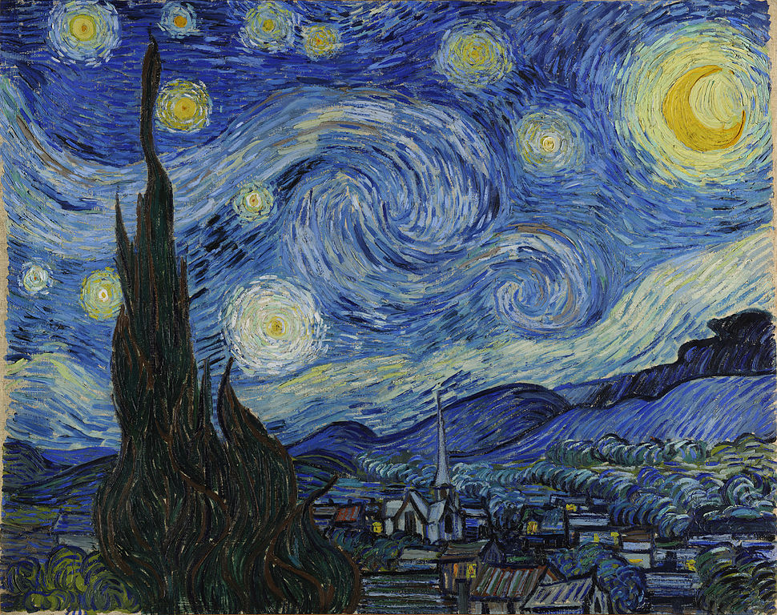
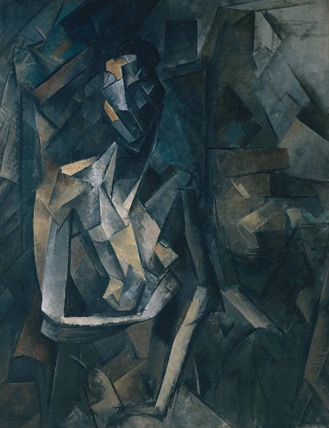

# Neural Style Transfer in PyTorch

## Motivation
This project was implemented as an attempt of recreating the original [neural style transfer paper](https://www.cv-foundation.org/openaccess/content_cvpr_2016/papers/Gatys_Image_Style_Transfer_CVPR_2016_paper.pdf).

## Neural Style Transfer
A Neural Algorithm of Artistic Style can separate and recombine the content and the style of natural images.
Neural Style Transfer is an algorithm which takes two images as input (content image and style image) and combines them into a new image. The new image will keep the *content* of the **content input image** and will capture the *style* of the **style input image**. .

## Implementation
This algorithm relies on the pretrained VGG19[2] model. We do not use the fully-connected part of the model, we only use certain layers of the convolutional part the model i.e.
the feature extractor.

How is the style transfer executed? Unlike some more traditional applications of machine learning,
here at each iteration we are modifying the pixels of the generated image, not the weights of the
network. Those weights are actually frozen. At the beginning of the algorithm we initialize our image
with content image, style image or with random gaussian noise and then at each iteration we update
the pixel values of the image by using backpropagation with respect to the computed loss function.

The algorithm uses *L-BFGS* optimizer as a default one as proposed in the paper.

## Style Transfer Results

| Content    | Style    | Generated    |
:-----------:|:--------:|:-------------:
||
||
||
||

## Content reconstruction
If we only included the content component when computing the loss, it would result in reconstruction of the content image. If we choose images which are lowe in the network hierarchy, then reconstruction of the content image would be almost perfect at pixel level. On the other hand if we choose higher layers, it would result in content image where the base shape of the objects would be kept, but there would be a significant difference at the pixel level. The main change in the pixel level can be at first seen in the window of the rightmost house. This is due to the fact the higher CNN layers tend to learn more general features, related to the content of the images, while the lower ones are more biased towards detecting edges, textures etc.

Below we can see reconstructed content image by using *conv1_2, conv2_2, conv3_2, conv4_2, conv5_2* layers of the VGG19 network respectively.

  
 
 
  
 

## Style reconstruction
Similarly to the previous section here we include only the style component. We are calculating the style loss, and according to that reconstructing the style image. We can notice that the usage of convolutional layers which are higher in the hierarchy results in style paterns which consist out of much larger objects than when we use only the lower layers of the CNN.

Below we can see reconstructed content image by using *conv1_1, conv2_1, conv3_1, conv4_1, conv5_1* layers of the VGG19 network respectively. **There is a small difference than in the previous section.** First image was reconstructed only using *conv1_1*, the second one by using *conv1_1* and *conv2_1*, third one by using *conv1_1*, *conv2_1* and *conv3_1* etc.

  
  
 
  
 

## Image initialization
Here we discuss how will the resulting image look like if we initialized the generated image differently.

We see that if we initialize from content image the resulting image will look more like the original content image. On the other hand if we intialize from style, we see that the resulting image contains much more elements of the used artwork (for example, the moon).

    <table>
     <tr>
      <td align="center"><b>From content</b></td><td align="center"><b>From style</b></td>
     </tr>
     <tr>
      <td></td> <td></td>
     </tr>
    </table>

If we initialize the image from random noise, the resulting image will be different each time. The resulting images will not differ drastically, but the difference will be present.

  
   
  
 

 
 
## Choise of the content layer
How does the final result change when we use different layer as the content layer?  
As we have previously said, CNNs learn more complex features progressively through the layers. If we try to visualize the learnt features, we would notice that the earlier layers tend to learn features like vertical & horizontal edges while the layer which are higher in the hierarchy try to learn much complex features and focus much more on the general shapes i.e. the content of the image. 

That means that if we choose our content layer to be the leayer which is higher in the hierarchy it would lead to image objects keeping their basic shape, but with some distortions.  
Below we can see an example of this. We can notice that when we use the layer *conv4_2* (which is higher in the hierarchy than the *conv2_2*) we are still aware that houses appear in the picture, but they appear more distorted. This can be noticed in the houses which are on the right part of the image.

    <table>
     <tr>
      <td align="center"><b>conv2_2</b></td><td align="center"><b>conv4_2</b></td>
     </tr>
     <tr>
      <td></td> <td></td>
     </tr>
    </table>

